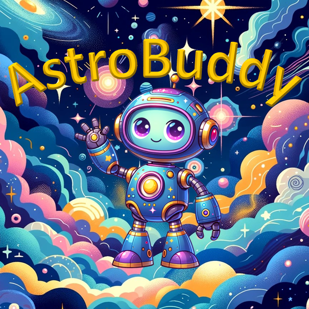

# AstroBuddy Chatbot



AstroBuddy is a chatbot designed to provide information and engage in conversation about astronomy-related topics with Primary School students between the ages of 7 and 11 (Key Stage 2). It utilizes natural language processing (NLP) techniques and a deep learning model to understand and respond to user queries.

## Table of Contents

- [Introduction](#introduction)
- [Features](#features)
- [Installation](#installation)
- [Usage](#usage)
- [File Structure](#file-structure)
- [Credits](#credits)
- [License](#license)

## Introduction

AstroBuddy is a Python-based chatbot application built using the following technologies:

- **PyTorch**: For implementing the deep learning model.
- **NLTK (Natural Language Toolkit)**: For natural language processing tasks such as tokenization and stemming.
- **SQLite**: For storing and retrieving conversation patterns and responses.
- **PyQt5**: For building the graphical user interface (GUI).

The chatbot includes functionalities such as loading conversation data from a SQLite database, training a Long Short-Term Memory (LSTM) neural network model, and providing responses to user input based on the trained model.

## Features

- **Database Interaction**: Load conversation data from a SQLite database.
- **Deep Learning Model**: Train an LSTM neural network model to understand and respond to user queries.
- **Graphical User Interface**: Utilize PyQt5 to create a user-friendly interface for interacting with the chatbot.

## Installation

To install and run AstroBuddy, follow these steps:

1. Clone the repository:

    ```
    git clone https://github.com/Leoconopoly/AstroBuddy-v0.5.git
    ```

2. Navigate to the project directory:

    ```
    cd AstroBuddy-v0.5
    ```

3. Install the required dependencies:

    ```
    pip install -r requirements.txt
    ```

4. Run the application:

    ```
    python app.py
    ```

## Usage

Upon launching the application, you will be greeted by AstroBuddy in the chat interface. You can start typing messages, and AstroBuddy will respond based on its training and the conversation data available in the database.

## File Structure

The project files are organized as follows:

- **`data/`**: Contains all JSON files used for the initial dataset.  
- **`db/`**: Contains `astrobuddy_v0.5.db`, the project's main database file.  
- **`project_media/`**: Contains all relevant media files used in the project.
- **`log_data/`**: Contains `chat_logs.db` and temporary log files from all chats.
- **`src/`**: Contains the following source code files:
  - **`api/`**: Handles all API functions.
    - **`nasa_media_requests.py`**: IN DEVELOPMENT - handles logic for pulling search images from NASA image library
  - **`application/`**: Functions for handling the GUI.    
    - **`app_utils.py`**: Utilities used by the GUI.    
    - **`application_logic.py`**: Handles the logic behind the GUI.    
    - **`main.py`**: Executes the GUI program and all other associated programs.    
    - **`ui_components.py`**: Handles the GUI components.  
  - **`chat_logic/`**: Directory for chat logic.    
    - **`chat.py`**: Handles chat logic.  
  - **`model_logic/`**: Directory for model logic.    
    - **`model.py`**: Definition of the LSTM neural network model.    
    - **`nltk_utils.py`**: Utility functions for text preprocessing using NLTK.    
    - **`train.py`**: Script for training the deep learning model.  
  - **`utils/`**: Directory for project utilities.    
    - **`intent_data.py`**: Loads intent data from JSON files
    - **`intents_db_main.py`**: Executes the intialization of the Intents Database
    - **`intetns_db.py`**: Handles logic behind Intents Database initilization and updates     
    - **`log_manager.py`**: Handles all logic for managing and storing the chat logs.

## Credits

- This project utilizes the [NLTK library](https://www.nltk.org/) for natural language processing tasks.
- The LSTM neural network model is implemented using [PyTorch](https://pytorch.org/).
- The graphical user interface is created with [PyQt5](https://www.riverbankcomputing.com/software/pyqt/intro).

## License

This project is dedicated to the public domain under the [Creative Commons Zero (CC0) License](https://creativecommons.org/publicdomain/zero/1.0/).